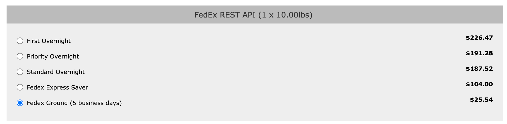

# FedExREST 

A Zen Cart shipping module for FedEx.  

### Support

- [Installation instructions](https://github.com/scottcwilson/zencart_fedexrest/wiki/Installation-Instructions)
- [Forum Support Thread](https://www.zen-cart.com/showthread.php?229562-FedEx-Shipping-using-REST-API)

### Developer Resources

- [Authorization API](https://developer.fedex.com/api/en-mx/catalog/authorization/v1/docs.html)
- [Rates API](https://developer.fedex.com/api/en-mx/catalog/rate.html#/api)

This module uses [FedEx's RESTful API](https://developer.fedex.com/api/en-mx/catalog.html).

As such, it replaces the [FedEx Web Services plugin](https://www.zen-cart.com/downloads.php?do=file&id=1784), which was based on the (now deprecated) older Web Services XML API.

### Configuration 

If your goal is to get approximately the same prices as the [FedEx Online Rating Tool](https://www.fedex.com/en-us/online/rating.html#), use these settings: 

- In the online rating tool: 
  - Enter the ship from and to addresses, the weight and number of packages.  Leave all other settings at their default values. 

- In Zen Cart Admin settings for FedEx REST: 
  - Ship From address is residential = false
  - Ship To address is residential = false
  - Pickup type = 3
  - Signature Option = -1 
  - Insurance = -1 
  - FedEx Rates = LIST 

If your goal is to get approximately the same prices as the older Web Services shipping method, use these settings:

- In the older FedEx module: 
  - Enable Address Validation = false
  - Drop off type to 1 or 3. 
  - FedEx Rates = LIST 

- In Zen Cart Admin settings for FedEx REST: 
  - Ship From address is residential = false
  - Ship To address is residential = true 
  - Pickup type = 1 or 3, based on whichever value is used in older module Drop off type setting
  - Signature Option = -1 
  - Insurance = 0 
  - FedEx Rates = LIST 

Note that you must test with items that are not free shipping and do not use the Numinix "ready to ship" flag.

### Appearance in Storefront

